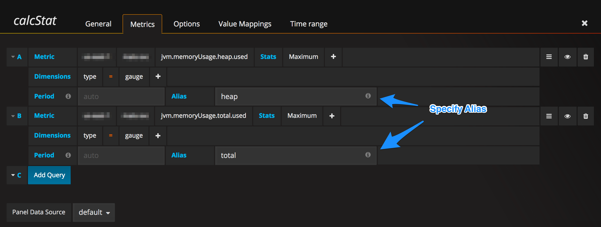
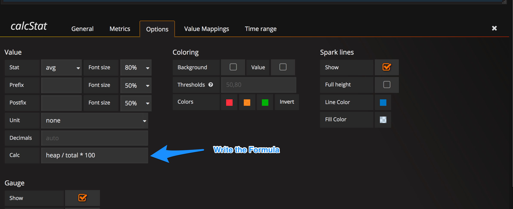
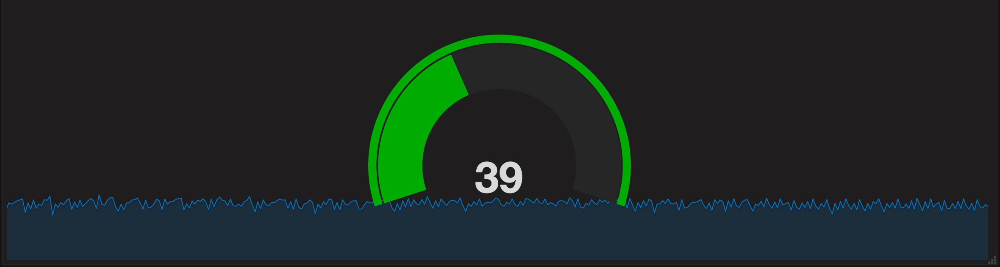

# CalcStat Panel -  Modified Version of SingleStat Plugin

The CalcStat Panel is a modified version of the SingleStat plugin **included** with Grafana.

The CalcStat Panel's base code is shamelessly stolen from the SingleStat plugin included with Grafana. It supports the SingleStat functionality of displaying the one main summary stat of a SINGLE series, as well as providing the new ability of displaying the calculated summary stat of MULTIPLE series. It reduces the series into a single number the same way as SingleStat (by looking at the max, min, average, or sum of values in the series). CalcStat also support all current SingleStat features such as provides thresholds to color the stat or the Panel background, translate the single number into a text value, and show a sparkline summary of the series.

## Step 1: Configure the metrics

## Step 2: Configure your calculation formula

## Step 3: Calculated single stat

## Installation
Clone the entire repo into the grafana plugin directory, after which simply restar the grafana server.
On Linux systems the grafana-cli will assume that the grafana plugin directory is /var/lib/grafana/plugins. It’s possible to override the directory which grafana-cli will operate on by specifying the –pluginsDir flag. On Windows systems this parameter have to be specified for every call.

## Disclaimer!
* Majority of the code is a direct port of the SingleStat plugin provided by Grafana.
* Sparkline summary are also calculated based on the flotpoints returned in the series, in cases where large number of points are returned from series, the calculation could potentially slow down the browser.
* It is adviced to use series of equal length, however if series are of different length, the longest series will be used, and calculation will be based on the last point of the shorter series.
* Tested only with cloud watch metrics as datasource and on Grafana 4.4.0+

References:
[http://docs.grafana.org/reference/singlestat/](http://docs.grafana.org/reference/singlestat/)
